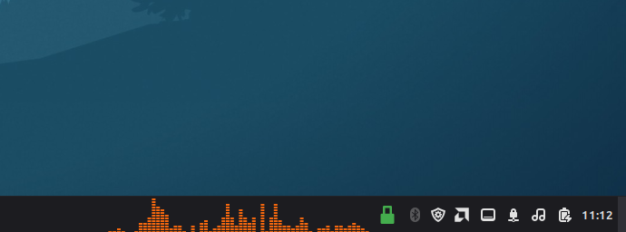
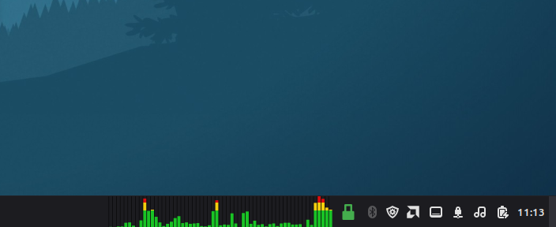
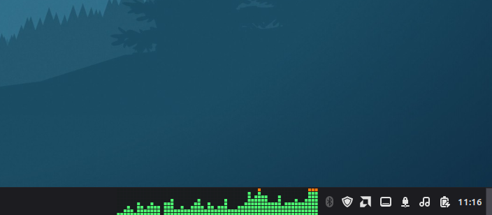
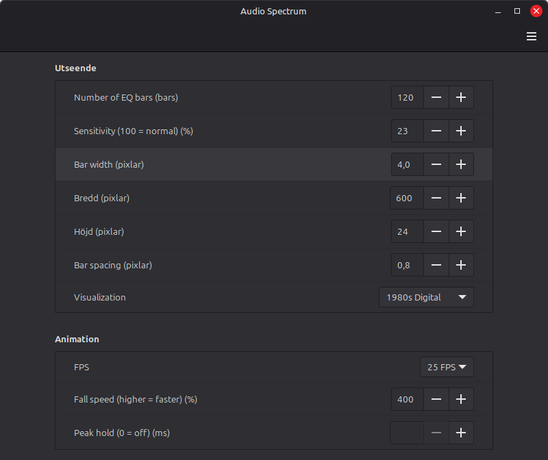

# Audio Spectrum

A real-time system audio spectrum visualizer for the Cinnamon desktop.

Audio Spectrum displays the audio currently playing on your system directly
in the Cinnamon panel, with multiple visualization styles and configurable
animation settings.

## Features

- Real-time system audio visualization
- Stereo analysis that avoids phase cancellation
- 10 visualization styles:
  - Classic LED
  - 80s Car Stereo
  - Dot Matrix
  - Classic Spectrum
  - Fire
  - Neon Line
  - VU Meter
  - 1980s Digital
  - Oscilloscope
  - Classic Neon
- Adjustable number of EQ bars and audio sensitivity
- Automatic width based on bar count, bar width and spacing
- Automatic panel-height fitting or manually selected visualizer height
- Top, center or bottom alignment in manual-height mode
- Selectable 20, 25, 30 or 60 FPS
- Adjustable fall speed and optional peak hold
- Restore-defaults button

## Screenshots

### 80s Car Stereo

### Classic LED

### 1980s Digital

## Requirements

- Cinnamon desktop environment
- CAVA 1.0 or newer (audio analysis backend)
- PulseAudio or PipeWire compatibility through CAVA's PulseAudio input

The Easy Install package checks CAVA and can help install or update it on
Linux Mint, Ubuntu and Debian-based systems. When a compatible system CAVA is
not available, it can install the tested CAVA 1.0.0 release privately for the
current user without replacing the system package.

## Installation

### Easy Install

For the simplest installation, download the Easy Install package from the
[Releases](https://github.com/CrazySwede87/audio-spectrum-cinnamon/releases)
section.

Extract the archive and run:

`Install Audio Spectrum.sh`

The installer checks CAVA and reloads an already active Audio Spectrum applet
after an installation or upgrade.

### Manual Installation

Copy the folder:

`audio-spectrum@crazyswede`

to:

`~/.local/share/cinnamon/applets/`

Then add **Audio Spectrum** to the Cinnamon panel through the Applets settings.
A compatible CAVA installation must be available in `PATH`, or at:

`~/.local/lib/audio-spectrum/cava`

## Configuration

Right-click the applet and open its settings to configure the visualization,
number of bars, sensitivity, bar geometry, height, alignment, animation speed,
fall speed and peak hold.

## Bug reports and feature requests

Report bugs or request features through
[GitHub Issues](https://github.com/CrazySwede87/audio-spectrum-cinnamon/issues).

For a bug report, include:

- Linux distribution and version
- Cinnamon version
- CAVA version
- Installation method
- Steps that reproduce the problem
- What you expected and what happened
- Relevant log output, if available

Please use the provided bug-report form when creating an issue.

## License

Copyright (C) 2026 CrazySwede

Audio Spectrum is free software licensed under the
GNU General Public License version 3 (GPL-3.0).

See [LICENSE](LICENSE) for the full license text.

